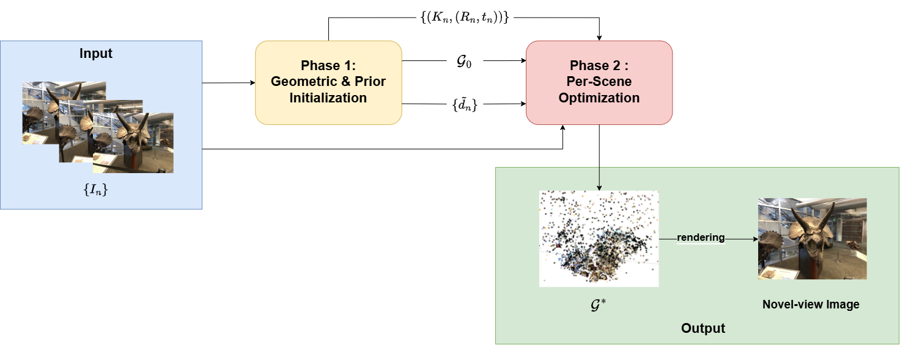
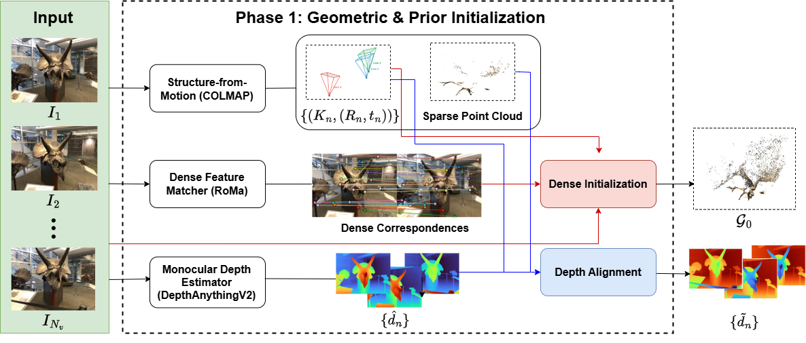
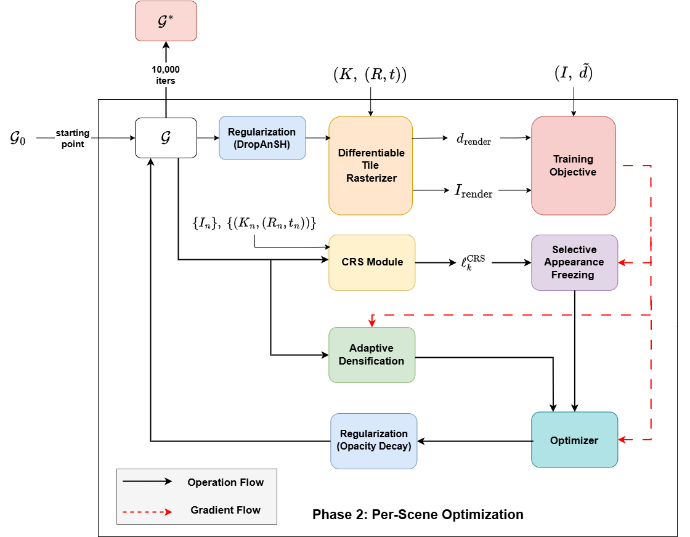
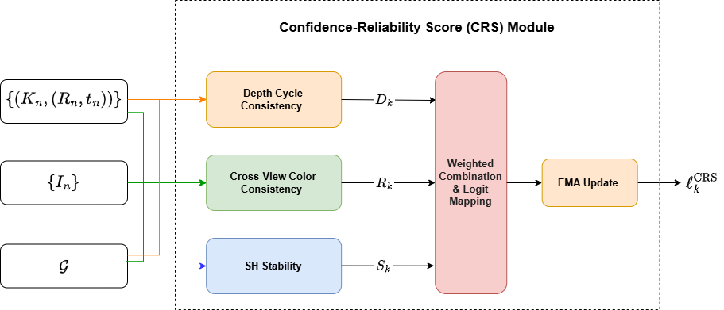

# ReDI-GS

**ReDI-GS: Reliable Dense Initialization for Sparse-view 3D Gaussian Splatting**

Code accompanying the thesis. ReDI-GS is a sparse-view Novel View Synthesis (NVS) method
built on top of 3D Gaussian Splatting that combines a dense initialization, a per-Gaussian
Confidence-Reliability Score (CRS), an adaptive densification strategy, and two regularizers,
into a single radiance field trained for 10,000 iterations.

On LLFF with 3 training views, ReDI-GS reaches **21.89 PSNR / 0.769 SSIM / 0.158 LPIPS**
(mean of N=24 paired runs, 3 seeds × 8 scenes), outperforming prior 3DGS-based sparse-view
methods including CoR-GS (+1.78 dB), FSGS (+1.58 dB), and Binocular3DGS (+0.45 dB).



*Overall ReDI-GS pipeline. Phase 1 takes three training images, the COLMAP poses, and the
sparse SfM point cloud to produce a dense initialization with RoMa v1 and a scale-aligned
depth prior with DepthAnything V2. Phase 2 then optimizes a single radiance field for
10,000 iterations under the CRS, the adaptive densification, and the two regularizers.*

## Method

ReDI-GS addresses three limitations of sparse-view 3DGS through five contributions,
organized into two phases.

### Phase 1 — Dense initialization and depth alignment



1. **Dense Initialization** with the pre-trained RoMa v1 matcher and a triangulation
   filter, replacing the impoverished SfM point cloud.
2. **Aligned Depth Prior** using DepthAnything V2 (ViT-L) with a weighted-least-squares
   scale alignment to COLMAP sparse depth.

### Phase 2 — Per-scene optimization



3. **Confidence-Reliability Score (CRS)** — a per-Gaussian reliability signal that fuses
   depth-cycle consistency, cross-view color consistency, and SH coefficient stability,
   smoothed by an EMA in logit space. The CRS drives a *selective appearance freezing* that
   zeros the high-degree SH gradients of unreliable Gaussians.

   

4. **Adaptive Densification (EFA-GS)** combining LFCF and AbsGS for low-frequency-first
   detail growth.
5. **Regularizers** — DropAnSH (anchor + SH coarse-to-fine dropout) at render time and
   opacity decay at the end of each iteration.

The full architecture, equations, and ablation results are presented in the thesis.

## Directory convention

The instructions below assume the following sibling layout. All command lines are run from
inside the ``ReDI-GS/`` directory unless stated otherwise.

```
<workspace>/
├── ReDI-GS/                  this repository
├── Depth-Anything-V2/        cloned from https://github.com/DepthAnything/Depth-Anything-V2
└── RoMa/                     cloned from https://github.com/Parskatt/RoMa  (optional, see notes)
```

## Installation

The training environment was tested on Ubuntu 22.04 with CUDA 12.x and a single
NVIDIA RTX A4000 (16 GB). The exact conda environments used in our experiments are
exported as ``environment.yml`` (training) and ``environment_roma.yml`` (dense matcher).

### 1. Training environment (`redigs`)

```bash
conda env create --file environment.yml
conda activate redigs

# Build the rasterizer (provides depth + confidence + alpha outputs)
pip install submodules/diff-gaussian-rasterization-confidence

# Build the k-NN extension used by DropAnSH anchor sampling
pip install submodules/simple-knn
```

Key dependencies (resolved by the env file): Python 3.8, PyTorch with CUDA support,
`torchmetrics`, `open3d==0.19`, `opencv-python`, `plyfile`, `kmeans1d`, and `matplotlib`.

### 2. Dense-matcher environment (`roma_v1`)

RoMa v1 needs newer Python and PyTorch than the training environment, so it lives in a
separate conda env to avoid library conflicts:

```bash
conda env create --file environment_roma.yml
conda activate roma_v1
```

This pulls `romatch==0.1.2` (the RoMa v1 PyPI package) so no manual clone of the RoMa
repository is needed; the matcher is imported as ``from romatch import roma_outdoor``.

### 3. Monocular depth prior — DepthAnything V2

Clone the DepthAnything V2 repository as a sibling of ``ReDI-GS/`` (so the training code
finds it at ``../Depth-Anything-V2``):

```bash
cd ..
git clone https://github.com/DepthAnything/Depth-Anything-V2.git
cd Depth-Anything-V2
mkdir -p checkpoints

# Download the ViT-L checkpoint from the official release page:
# https://huggingface.co/depth-anything/Depth-Anything-V2-Large
# and place it at:
#   ../Depth-Anything-V2/checkpoints/depth_anything_v2_vitl.pth
```

The ReDI-GS training script looks up the checkpoint at
``<dav2_path>/checkpoints/depth_anything_v2_<encoder>.pth`` (default
``dav2_path=../Depth-Anything-V2``, ``encoder=vitl``).

### 4. COLMAP

A COLMAP binary on the ``PATH`` is required for the per-N-view subset generation. Any
recent COLMAP (3.7+) with the CLI subcommands ``feature_extractor``,
``exhaustive_matcher``, ``point_triangulator``, ``image_undistorter``,
``patch_match_stereo`` and ``stereo_fusion`` is fine.

## Dataset — LLFF

Download the LLFF dataset from the
[NeRF authors](https://drive.google.com/drive/folders/128yBriW1IG_3NJ5Rp7APSTZsJqdJdfc1)
and place it under ``data/`` so each scene has the COLMAP outputs that ship with the
release:

```
data/
└── nerf_llff_data/
    ├── fern/
    │   ├── images/                       Full-resolution training views
    │   ├── images_4/  images_8/          Downsampled copies (used at -r 4 / -r 8)
    │   ├── sparse/0/                     COLMAP outputs over all views
    │   │   ├── cameras.bin
    │   │   ├── images.bin
    │   │   └── points3D.bin
    │   └── poses_bounds.npy
    ├── flower/
    ├── fortress/
    ├── horns/
    ├── leaves/
    ├── orchids/
    ├── room/
    └── trex/
```

The official LLFF release already ships ``sparse/0/`` (full-views COLMAP), but the
sparse-view experiments additionally need a *per-N-view* COLMAP triangulation and MVS
under ``<scene>/3_views/`` (or ``6_views``, ``9_views``). The next step builds these.

### Generating the per-N-view COLMAP subsets

Open ``tools/colmap_llff.py`` and edit the ``base_path`` at the bottom (the
``if __name__ == '__main__'`` block) to your absolute path to ``data/nerf_llff_data/``,
then:

```bash
conda activate redigs
python tools/colmap_llff.py
```

This iterates the 8 LLFF scenes with ``n_views=3`` and produces, for each scene,

```
<scene>/3_views/
├── images/             3 selected training images (a deterministic subset)
├── database.db         COLMAP database for the 3-view subset
├── created/            intermediate files used by point_triangulator
├── triangulated/       sparse output: cameras.bin, images.bin, points3D.bin
└── dense/
    └── fused.ply       COLMAP MVS dense point cloud over the 3 selected views
```

For the 6- and 9-view experiments, change ``n_views=3`` to ``n_views=6`` or
``n_views=9`` inside the same ``__main__`` block before each run.

## Reproducing the main result (LLFF 3-view)

After the four-step installation above and the COLMAP subset generation, the main
result is reproduced in three stages.

### Stage 1 — Dense initialization with RoMa v1

For every scene, this step matches every pair of the 3 training images with RoMa v1,
triangulates the correspondences with the COLMAP poses, filters by chirality and
reprojection error (``<= 2 px``), and writes the cloud to
``data/nerf_llff_data/<scene>/3_views/dense/fused.ply.romav1``.

```bash
conda activate roma_v1

# Option A — all 8 scenes split across 2 GPUs. Total wall-clock ~1 minute.
bash scripts/preprocess_all.sh

# Option B — one scene at a time on a single GPU
SCENE=fern   python scripts/preprocess.py
SCENE=flower python scripts/preprocess.py
# ... and so on for fortress, horns, leaves, orchids, room, trex
```

### Stage 2 — Place the dense init and train

The training code expects ``fused.ply`` itself to contain the dense initialization, so
the placement script first backs up the original COLMAP MVS file (as
``fused.ply.colmap_mvs_backup``) and then copies the RoMa v1 file in:

```bash
conda activate redigs

# Swap fused.ply <- fused.ply.romav1 for all 8 scenes
python scripts/place_init.py

# Train under the production recipe (3 seeds × 8 scenes = 24 runs, ~5 hours on 2 GPUs)
bash scripts/run.sh
```

``run.sh`` splits the 8 scenes across two GPUs and internally calls
``scripts/trainer.sh`` with ``CONFIG=trim_full`` for every (scene, seed) pair. The
recipe applies the depth prior + D-cycle + SH stability + SH-CRS freeze + DropAnSH +
opacity decay + LFCF + AbsGS.

To restore the original COLMAP MVS init at any time:

```bash
RESTORE=1 python scripts/place_init.py
```

### Stage 3 — Extract metrics

```bash
python scripts/analyze.py
```

The script aggregates PSNR, SSIM, LPIPS, and the Gaussian count over the 24 logs in
``logs/run/`` and reports the per-scene means together with the overall N=24 mean.

## Quick smoke test

Before launching the full 5-hour training, the following one-scene, 100-iteration run
confirms that every dependency resolves and that the data is wired correctly:

```bash
conda activate redigs

python train.py \
    --source_path data/nerf_llff_data/fern \
    --model_path output/smoke_test \
    --eval -r 8 --n_views 3 --random_background \
    --iterations 100 --test_iterations 100 \
    --use_depth_prior --dav2_path ../Depth-Anything-V2
```

The run should complete in roughly one minute on a modern GPU. If it terminates with
a ``PSNR`` line in the log, the installation is healthy.

## Reproducing the ablation study

The same ``trainer.sh`` that ``run.sh`` calls internally can be used to train any
single configuration of the per-component leave-one-out (LOO) ablation by selecting
the cell through the ``CONFIG`` environment variable:

```bash
# Train one ablation cell (trim_full = full recipe reference)
GPU=0 CONFIG=trim_no_dcycle SCENES_OVERRIDE="fern flower fortress horns" \
    SEEDS_OVERRIDE="42" \
    LOG_DIR=logs/ablation/trim_no_dcycle \
    OUT_DIR=output/ablation/trim_no_dcycle \
    bash scripts/trainer.sh
```

Available ``CONFIG`` values are ``trim_full``, ``trim_no_dcycle``, ``trim_no_shcrs``,
``trim_no_depthcrs``, ``trim_no_drop``, ``trim_no_opacity``, ``trim_no_efa``, and
``base``. Point ``analyze.py`` at the matching ``LOG_DIR`` to aggregate the metrics:

```bash
LOG_DIR=logs/ablation/trim_no_dcycle python scripts/analyze.py
```

## Codebase layout

```
train.py                          Main training loop with all hooks
render.py                         Evaluation renderer
metrics.py                        PSNR / SSIM / LPIPS computation
arguments/__init__.py             Hyperparameter definitions and CLI flags
scene/
├── __init__.py                   Scene loading and camera setup
├── gaussian_model.py             Gaussian model with _crs_score, AbsGS,
│                                 opacity decay, LFCF integration
├── dataset_readers.py            COLMAP reader exposing reprojection errors
└── cameras.py                    Camera utilities
gaussian_renderer/__init__.py     Differentiable renderer with DropAnSH
utils/
├── crs/
│   ├── crs_module.py             update_crs, cross-view R, fusion, EMA
│   ├── d_cycle.py                D-cycle (round-trip 3D) signal
│   ├── sh_stability.py           S signal (EMA variance of SH high-degree)
│   └── sh_freeze.py              Selective appearance freezing
├── densify/
│   └── lfcf.py                   LFCF action decision + volume-preserving scale
├── regularizer/
│   └── dropansh.py               DropAnSH anchor + SH coarse-to-fine dropout
└── depth/
    ├── depth_model.py            DepthAnything V2 ViT-L wrapper
    └── depth_alignment.py        Weighted-least-squares scale alignment
lpipsPyTorch/                     LPIPS metric implementation used by train/metrics
scripts/
├── preprocess.py                 Dense init via RoMa v1 for a single scene
├── preprocess_all.sh             Wrapper running preprocess.py on all 8 scenes
├── place_init.py                 Swap fused.ply with the RoMa v1 dense init
├── run.sh                        Main training driver (24 runs across 2 GPUs)
├── trainer.sh                    Inner trainer called by run.sh (also used for ablation)
└── analyze.py                    Aggregate per-run logs into PSNR/SSIM/LPIPS tables
tools/
└── colmap_llff.py                Per-N-view COLMAP pipeline for LLFF
submodules/
├── diff-gaussian-rasterization-confidence/  Differentiable tile rasterizer
└── simple-knn/                              k-NN utility for DropAnSH anchors
```

## Key hyperparameters

The production recipe is parameterized by the flags below; the values match the thesis
table of important hyperparameters.

```
Iterations                    10,000
Densification window          iter 500 -- 5,000, interval 100
Positional gradient threshold 5e-4
CRS warm-up                   1,000 iter
CRS update interval           every 100 iter
D-cycle reprojection sigma    5.0 px
SH-CRS freeze threshold tau   0.5
CRS triplet weight w_s        0.33
EMA decay beta                0.3
DropAnSH (p_a, p_sh)          (0.02, 0.20)
Opacity decay factor          0.999
LFCF init scale (max / min)   1.5 / 1.0
AbsGS                         enabled
```

## Results

Quantitative comparison on LLFF with 3 training views (mean over N=24 paired runs).

| Method            | PSNR  | SSIM  | LPIPS |
|-------------------|-------|-------|-------|
| 3DGS              | 15.52 | 0.405 | 0.408 |
| DNGaussian        | 19.12 | 0.591 | 0.294 |
| FSGS              | 20.31 | 0.652 | 0.288 |
| CoR-GS            | 20.45 | 0.712 | 0.196 |
| LoopSparseGS      | 20.85 | 0.717 | 0.205 |
| NexusGS           | 21.07 | 0.738 | 0.177 |
| Binocular3DGS     | 21.44 | 0.751 | 0.168 |
| **ReDI-GS (ours)**| **21.92** | **0.769** | **0.158** |

ReDI-GS also leads at 6 and 9 views; see the thesis Results chapter for the full
tables and the per-component contribution analysis.

## Acknowledgement

This project builds on the following open-source works:

- [3D Gaussian Splatting](https://github.com/graphdeco-inria/gaussian-splatting) — base rasterizer and training framework
- [CoR-GS](https://github.com/jiaw-z/CoR-GS) — codebase scaffold
- [FSGS](https://github.com/VITA-Group/FSGS) — Pearson depth-loss formulation
- [DepthAnything V2](https://github.com/DepthAnything/Depth-Anything-V2) — monocular depth prior
- [RoMa](https://github.com/Parskatt/RoMa) — dense feature matcher
- [DropAnSH](https://arxiv.org/abs/2405.17890) — dropout regularizer (DropAnSH-GS)
- [Binocular3DGS](https://github.com/hanl2010/Binocular3DGS) — opacity-decay regularizer
- [AbsGS](https://github.com/TY424/AbsGS) — absolute-gradient densification
- [EFA-GS](https://github.com/lin-jiawei/EFA-GS) — LFCF densification with volume-preserving scaling
- [DepthRegularizedGS](https://github.com/robot0321/DepthRegularizedGS) — weighted scale-alignment idea
